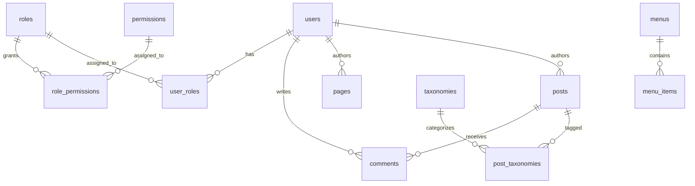

# Database Architecture and Schema

This document details the database schema, table relationships, dynamic prefixing, and migration system of **Favorite CMS Universal v1.0.0**.

---

## Database Requirements

- **Engine:** MySQL 5.7+ or MariaDB 10.3+.
- **Storage Engine:** **InnoDB** is strictly required for ACID transactions and foreign key constraints.
- **Character Set & Collation:** `utf8mb4` with `utf8mb4_unicode_ci` (supports full 4-byte UTF-8, including emojis and international scripts).

---

## Configuration & Connection

Database parameters are configured via environment variables or the `.env` file:
```ini
DB_CONNECTION=mysql
DB_HOST=127.0.0.1
DB_PORT=3306
DB_DATABASE=favorite_cms
DB_USERNAME=db_user
DB_PASSWORD=secret_password
DB_PREFIX=fc_
```

Connections are instantiated via PDO in `FavoriteCMS\Core\Database` with strict error reporting (`PDO::ERRMODE_EXCEPTION`) and disabled emulation of prepared statements (`PDO::ATTR_EMULATE_PREPARES = false`).

---

## Table Prefix Handling

Favorite CMS Universal allows multiple sites to share a single database by prepending a table prefix (default `fc_`).

The `Database` class transparently prepends the prefix to known tables when executing queries:
- Core tables are registered automatically during database provisioning.
- Third-party plugins register their custom tables by listing them in the `tables` array of their `plugin.json` manifest:
  ```json
  {
      "id": "my-plugin",
      "tables": ["plugin_orders", "plugin_items"]
  }
  ```
- When activated, `Database::registerPrefixableTables(['plugin_orders', 'plugin_items'])` registers them, enabling dynamic prefixing for all queries.

---

## Schema Migrations

Database tables are created and maintained through incremental migration files located in `database/migrations/`:

| Migration File | Primary Tables Created / Modified |
|---|---|
| `001_create_cms_migrations_table.php` | `cms_migrations` (Tracks executed migrations) |
| `002_create_users_table.php` | `users` (User accounts, auth_version, statuses) |
| `003_create_roles_permissions.php` | `roles`, `permissions`, `user_roles`, `role_permissions` |
| `004_create_posts_table.php` | `posts` (Articles, status, slugs, LONGTEXT content) |
| `005_create_pages_table.php` | `pages` (Hierarchical pages, templates) |
| `006_create_taxonomies_table.php` | `taxonomies`, `post_taxonomies` (Categories & Tags) |
| `007_create_media_table.php` | `media` (Asset paths, MIME types, dimensions, metadata) |
| `008_create_menus_table.php` | `menus`, `menu_items` (Navigation structures) |
| `009_create_settings_table.php` | `settings` (System settings by group and key) |
| `010_create_seo_meta_table.php` | `seo_meta` (SEO titles, descriptions, Open Graph data) |
| `011_create_sessions_table.php` | `sessions` (Database-backed session store) |
| `012_create_plugin_settings_table.php` | `plugin_settings` (Isolated plugin options) |
| `013_create_comments_table.php` | `comments` (Post comments and moderation status) |
| `014_create_email_verifications_table.php` | `email_verifications` (Email confirmation tokens) |
| `015_create_password_resets_table.php` | `password_resets` (Password recovery tokens) |
| `016_update_role_permissions.php` | Updates role permission assignments |
| `017_align_role_permission_matrix.php` | Establishes the authoritative 6-role permission matrix |

---

## Entity Relationship Overview



---

## Plugin Table Isolation

To preserve database stability and prevent conflicts:
1. Plugins must prefix all created tables with their plugin namespace or unique identifier (e.g. `fc_cart_items`, `fc_stream_videos`).
2. Foreign key constraints to core tables (such as `users` or `posts`) must use `ON DELETE CASCADE` or `ON DELETE SET NULL` appropriately.
3. Plugins must never alter core tables directly. Custom fields should be stored in plugin tables or the `plugin_settings` table.

---

## Backup & Portability Considerations

- Content fields (`posts.content`, `pages.content`) utilize MySQL `LONGTEXT` (up to 4 GB per article) to store rich text, code blocks, and embedded media.
- Backups generated via `BackupService` dump the database in chunks with explicit `CREATE TABLE IF NOT EXISTS` directives and transactional wrappers to prevent partial restores.
